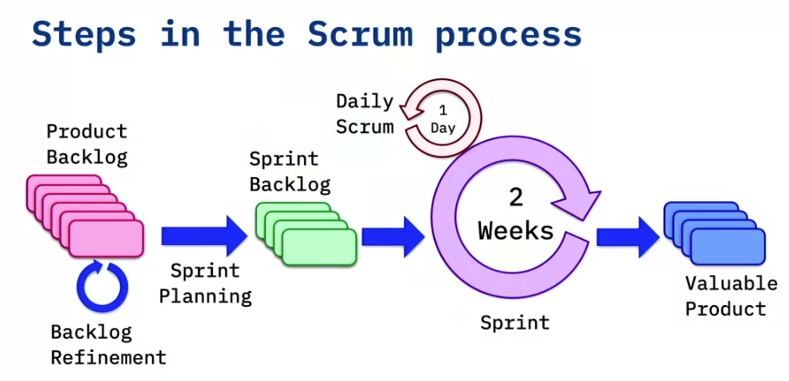

# Agile Development and Scrum

## Table of Contents
- [Agile Philosophy](#agile_philosophy)
- [Scrum Methodology](#scrum_methodology)
- [Organizing for Success](#organizing_for_success)
- [Planning to be Agile](#planning_to_be_agile)
- [User Stories](#user_stories)
- [The Planning Process](#planning_process)
- [Executing the Plan](#executing_plan)
- [Completing the Sprint](#completing_sprint)
- [Measuring Success](#measuring_success)
- [Resources](#resources)

## Agile Philosophy

<b>(click to expand/hide)</b>

<!-- MarkdownTOC -->

# Agile Overview

<b>(click to expand/hide)</b>

<!-- MarkdownTOC -->

## Definition
Agile is an iterative, collaborative approach to project management, particularly prevalent in software development, enabling teams to deliver value to customers quickly and efficiently.

## Key Characteristics
- **Iterative Development:** Small increments of work, allowing for customer feedback.
- **Adaptive Planning:** Planning in short spans to facilitate flexibility.
- **Evolutionary Development:** Gradual progress, building projects in pieces for easy adjustment.
- **Early Delivery:** Quick, consistent delivery of project parts to receive customer feedback.
- **Continuous Improvement:** Regular refining of methods and end-products based on feedback.
- **Responsiveness to Change:** The ability to adapt to project changes swiftly.

## Agile Manifesto
The Agile Manifesto emphasizes:
1. **Individuals and interactions** over processes and tools.
2. **Working software** over comprehensive documentation.
3. **Customer collaboration** over contract negotiation.
4. **Responding to change** over following a plan.

_While there is value in the items on the right, Agile prioritizes the items on the left._

## Agile Software Development
- Adherence to the principles of the Agile Manifesto.
- Emphasizing flexibility, peer interaction, and customer engagement.
- Maintaining high transparency among team members.
- Utilization of small, co-located, cross-functional, self-organizing, self-managing teams.

## Conclusion
- Agile promotes building what is currently needed by the customer, not just what was originally planned.
- The methodology encourages adaptability and customer-centricity in software development.
- It fosters a dynamic environment of continuous improvement and response to change.

<!-- /MarkdownTOC -->

---

### Methodologies Overview

<b>(click to expand/hide)</b>

<!-- MarkdownTOC -->

# Software Development Methodologies

## Traditional Waterfall Development

- **Phased approach:** Requirements, Design, Coding, Integration, Testing, Deployment
- **Issues:**
  - Lack of provision for change
  - Discovery of issues late in the process
  - Information loss between phases
  - High cost of mistakes found later in development
  - Long lead times
  - Siloed teams unaware of their impact on others

## Extreme Programming (XP)

- **Introduced:** 1996 by Kent Beck
- **Nature:** Iterative, foundation for Agile
- **Goal:** Improve software quality, responsiveness to changing customer requirements
- **Core Values:**
  - **Simplicity:** Focus on what is necessary, avoid over-engineering
  - **Communication:** Regular interaction within the team
  - **Feedback:** Essential for continual improvement
  - **Respect:** Equal and valuable contribution from all team members
  - **Courage:** Honest estimations, commitments without padding

## Kanban

- **Origin:** Japanese manufacturing systems
- **Key Principles:**
  - **Visualize the workflow:** Important for understanding and managing work
  - **Limit work in progress (WIP):** Focus on completing current tasks effectively
  - **Manage and enhance flow:** Constantly seek improvement and efficiency
  - **Explicit policies:** Clear understanding of the process and 'Definition of Done'
  - **Continuous improvement:** Constant iterative feedback for process enhancement

## Summary

- The **Waterfall approach** is structured and linear but lacks flexibility, leading to potential issues surfacing late in development, causing costly remedies and delayed deliveries.
- **Extreme Programming (XP)** is an agile methodology introduced to improve software quality and responsiveness, emphasizing customer satisfaction and internal team dynamics. Its values are simplicity, communication, feedback, respect, and courage.
- **Kanban** introduces principles from Japanese manufacturing, focusing on visual task management, limiting WIP, and continuous improvement. It emphasizes efficiency, clarity, and process enhancement.

<!-- /MarkdownTOC -->

---

### Working Agile

<b>(click to expand/hide)</b>

<!-- MarkdownTOC -->

# Agile Development Practices Summary

## Working in Small Batches

- Originates from lean manufacturing principles.
- Helps prevent waste by identifying issues early before they scale.
- Example: Single piece flow in mailing brochures allows immediate quality checks.

## Minimum Viable Product (MVP)

- Not merely phase one of a project.
- The simplest version of a product used to test hypotheses and gather learnings.
- Focuses on continuous improvement through customer feedback.
- Example: Iterative development from a skateboard to a car based on user needs and feedback.

## Behavior Driven Development (BDD)

- Describes the system from the outside in, focusing on user interaction.
- Often applied at integration testing level, testing the system’s overall behavior.
- Uses Gherkin syntax for clear, understandable scenarios by both stakeholders and developers.

## Test Driven Development (TDD)

- A method of testing the system from the inside out.
- Focuses on unit testing and the functionality of individual modules.
- Follows a "Red, Green, Refactor" workflow: write test, write code to pass the test, then improve code.

## Pair Programming

- Involves two programmers working together at one workstation.
- Enhances code quality through real-time review and collaboration.
- Facilitates knowledge sharing and mentorship among team members.
- Leads to early defect discovery and reduced maintenance costs.

## Conclusion

Adopting Agile practices such as working in small batches, developing MVPs, and engaging in BDD, TDD, and pair programming can lead to more efficient production cycles, higher quality products, and more responsive, adaptive development processes.

<!-- /MarkdownTOC -->

---

<!-- /MarkdownTOC -->

---

## Scrum Methodology

<b>(click to expand/hide)</b>

<!-- MarkdownTOC -->

### Scrum Overview

<b>(click to expand/hide)</b>

<!-- MarkdownTOC -->

# Agile vs. Scrum Summary Notes

## Overview
- **Agile**: A philosophy or mindset focused on iterative development, collaboration, and adaptability.
- **Scrum**: A methodology implementing Agile principles in a prescriptive and structured manner.

## Scrum in Detail

### Characteristics
- Management framework for incremental product development.
- Emphasizes small, cross-functional, self-managing teams.
- Provides structure through roles, rules, and artifacts.
- Iterative approach using fixed-length increments called "sprints."
- Aims for a potentially shippable product increment after each sprint.

### Challenges
- Easy to understand but difficult to master.
- Requires experience, consider hiring a mentor for guidance.

### The Sprint
- One iteration through the design, code, test, deploy cycle.
- Each sprint has a clear goal.
- Typically two weeks long (varies from one to four weeks).
- Must result in a deployable increment to gather customer feedback.

### Steps in the Scrum Process
1. **Product Backlog**: The comprehensive list of project tasks.
2. **Backlog Refinement**: Grooming tasks to ensure they are ready for the next phase.
3. **Sprint Planning**: Creating a sprint backlog from the product backlog tasks.
4. **Daily Scrum/Stand-up**: Daily team update meeting.
    - What was done yesterday?
    - What will be done today?
    - Any blockers?
5. **Sprint Review and Retrospective**: Assessing the completed work and team's process.

### Iterative Development
- Continuous cycle: Design, code, test, deploy.
- Feedback from each sprint informs the next.
- Central to Scrum, ensuring agility and customer focus.

## Conclusion
- Scrum is an Agile framework with a clear, structured methodology.
- It requires commitment and understanding, often necessitating experienced guidance.
- Sprints keep the team focused and aligned with user feedback.
- The process is iterative, adapting to insights gathered throughout the project's progression.

<!-- /MarkdownTOC -->

---

### The 3 Roles of Scrum

<b>(click to expand/hide)</b>

<!-- MarkdownTOC -->

# Scrum Roles Summary

## Overview
Scrum framework involves three pivotal roles:
1. **Product Owner**
2. **Scrum Master**
3. **Scrum Team**

---

## 1. Product Owner
- **Key liaison** between stakeholders and the Scrum team.
- **Articulates product vision**, ensuring the team understands the directions and goals.
- **Decides on requirement priorities**, controls the product backlog, and adjusts expectations.
- **Authority to accept or reject work results** based on whether the increments meet the requirements and vision.

### Responsibilities
- Represents stakeholders' interests and needs.
- Holds the decision power on continuing or adjusting development paths.
- Ensures the product backlog is refined and ready for sprints.

---

## 2. Scrum Master
- **Facilitates and enforces Scrum processes** and ensures the team follows the agreed-upon rules.
- Acts as a **shield** for the team from external distractions and interferences.
- **Resolves impediments** and focuses on creating a productive work environment.
- **Enforces timeboxes** for various Scrum events to keep the team within schedule.
- **No direct management authority** over the team, acting more as a servant leader and coach.

### Responsibilities
- Coaches the team and helps them to uphold Scrum values.
- Collects empirical data for progress tracking and potential forecast adjustments.
- Encourages a self-organizing and autonomous team environment.

---

## 3. Scrum Team
- **Cross-functional** group involving various roles (developers, testers, business analysts, etc.).
- **Self-organizing and self-managing** with members assigning work to themselves.
- Ideally, teams are small (often recommended as seven plus or minus two) and **co-located**.

### Characteristics
- Members work full-time on the team, dedicated to one project at a time.
- The team commits to work incrementally, one sprint at a time.
- High autonomy in deciding how to meet sprint goals.

### Best Practices
- Co-located teams or at least members being in the same geographical/time zone for better collaboration.
- Long-term dedication to projects, without members being shuffled around.

---

## Conclusion
In Scrum, the **Product Owner** is the vision setter, the **Scrum Master** is the facilitator, and the **Scrum Team** is the executor. Each role complements the others, driving collaborative and efficient project progress. The key to success includes clear communication, understanding of roles, and adherence to the Scrum principles and guidelines.

<!-- /MarkdownTOC -->

---

### Artifacts, Events, and Benefits

<b>(click to expand/hide)</b>

<!-- MarkdownTOC -->

# Scrum Overview

## Artifacts of Scrum

1. **Product Backlog**
   - A comprehensive list of user stories and requirements for the product that are yet to be completed.
   - May include various backlogs (icebox, release backlog) generally referred to as the product backlog.

2. **Sprint Backlog**
   - User stories selected for completion in the upcoming sprint (typically two weeks).

3. **Done Increment**
   - The product increment completed at the end of a sprint.

## Scrum Events

1. **Sprint Planning Meeting**
   - Attendance: Product Owner, Scrum Master, and Development Team.
   - Purpose: Plan the work for the upcoming sprint.

2. **Daily Scrum / Stand-up**
   - A daily meeting for status updates and impediment removal.

3. **Sprint**
   - The time-boxed period (usually two weeks) where the team works to complete the selected work.

4. **Sprint Review**
   - A meeting where the team demonstrates the new features to stakeholders.

5. **Sprint Retrospective**
   - The team reflects on the past sprint and plans improvements for the next one.

## Benefits of Using Scrum

- Higher productivity through daily meetings and visibility (via tools like a Kanban board).
- Improved quality via engaged teams and practices like TDD (Test Driven Development).
- Reduced time-to-market due to incremental delivery.
- Increased stakeholder satisfaction through frequent progress visibility.
- Enhanced team dynamics and happiness due to transparency and shared responsibilities.

## Scrum vs. Kanban

- **Cadence**: Scrum has fixed-length sprints, while Kanban is a continuous flow.
- **Release Methodology**: Scrum releases at the end of each sprint, whereas Kanban follows a continuous delivery model.
- **Roles**: Scrum assigns specific roles (Product Owner, Scrum Master, Development Team); Kanban doesn’t prescribe specific roles.
- **Key Metrics**: Scrum measures velocity; Kanban focuses on cycle time.
- **Change Philosophy**: Scrum limits changes during sprints, while Kanban accommodates changes at any time.

## Conclusion

Scrum, with its structured approach and specific roles and rituals, promotes a productive and collaborative environment that enhances product quality, reduces delivery time, and increases stakeholder satisfaction.

<!-- /MarkdownTOC -->

---

<!-- /MarkdownTOC -->

---

## Organizing for Success

<b>(click to expand/hide)</b>

<!-- MarkdownTOC -->

### Organizational impact of Agile

<b>(click to expand/hide)</b>

<!-- MarkdownTOC -->

# Agile Organization and Alignment with DevOps

## Key Insights from the Video

### Understanding Agile Team Organization

- **Conway's Law**: Organizations are prone to designing systems that mirror their own communication structure.
  - Teams divided by function (UI, application, database) tend to create systems reflecting this segmentation (e.g., three-tier architecture).

- **Optimal Team Structure in Agile**:
  - Teams should be **loosely coupled** to minimize dependencies.
  - Despite low coupling, teams need **tight alignment** on goals, as they contribute to a single product.
  - Each team should have a **specific mission** aligned with business objectives (e.g., separate teams for order handling, accounts, shopping cart, etc., in an e-commerce application).
  - Teams must have **end-to-end responsibility**, encompassing building, running, and debugging their product elements.
  - A **long-term mission** is essential for team stability and ownership.

- **Importance of Autonomy**:
  - Autonomy keeps teams motivated, leading to higher-quality outputs.
  - Decisions made at the team level enhance speed and efficiency.

### The Wall of Confusion in Development vs. Operations

- Traditional conflict exists between Development (seeking change) and Operations (seeking stability), often depicted as the "wall of confusion."
- The disjoint can cause significant delays in production deployment, negating the agility in development processes.

### Need for Agile Across the Organization

- **DevOps as a Solution**:
  - Addresses the divide between Development and Operations.
  - Ensures the entire organization is aligned in agility, preventing bottlenecks.
  - Accelerates time to market by making the operations team as agile as the development team.

- **Alignment of Agile and DevOps**:
  - Both aim for faster delivery, responsiveness to change, higher quality, and increased productivity.
  - Adoption of DevOps complements and enhances the effectiveness of Agile.

### Summary

Organizing teams with autonomy and end-to-end responsibilities leads to more efficient, motivated teams and better products. However, without adopting Agile principles across the entire organization, including operations, companies risk creating bottlenecks that hinder rapid deployment and fast response to change. Integrating DevOps with Agile practices is essential for aligning goals across departments, ultimately leading to quicker time to market and more responsive product development.

<!-- /MarkdownTOC -->

---

### Mistaking Iterative Development for Agile

<b>(click to expand/hide)</b>

<!-- MarkdownTOC -->

# Understanding True Agile Practices

## Common Misconceptions and Pitfalls in "Agile" Adoption

### The Pitfall of "Water-Scrum-Fall"

- **Problematic Approach**:
  - Organizations claim to be Agile but engage in extensive upfront planning (the "fuzzy front end").
  - Development seems iterative, but there's no real agility because they don't seek customer feedback after each iteration.
  - The deployment phase ("the last mile") is slow and cumbersome due to the lack of previous integration efforts.

- **Consequences**:
  - This approach misses the essence of being truly Agile.
  - It lacks responsiveness to change and immediate customer feedback.

### What Agile Is Not

- **Not Just Iterative Development**: 
  - Simply breaking the development process into sprints doesn't constitute Agile.
  - Agile involves constant feedback, adaptability, and a more integrated approach to team roles.

- **Not Just a Group of Developers**: 
  - An Agile team is cross-functional, involving testers, business analysts, operations personnel (in a DevOps context), etc., alongside developers.

- **No Traditional Project Managers**:
  - Agile doesn't accommodate a command-and-control style project manager role.
  - Teams self-manage and distribute tasks internally, promoting autonomy and collective ownership.

### Characteristics of Genuine Agile Practices

- **Responsiveness and Adaptability**: 
  - True agility is being able to pivot quickly based on feedback and changes.
  - The goal is to deliver value frequently and adjust to evolving project insights and market conditions.

- **Integrated Team Dynamics**:
  - Encouraging diverse roles within teams to blur traditional boundaries.
  - Emphasizing collaboration and shared responsibility.

- **Leadership within Agile**:
  - Leadership roles in Agile facilitate, rather than dictate, promoting a conducive environment for the team's self-management.

## Conclusion

Many organizations mistakenly label their processes as "Agile" when they're actually engaging in a hybrid of Waterfall and Scrum without the core principles of Agile. True Agile methodology is not merely about iterative development; it's about a holistic approach that embraces change, values feedback, encourages cross-functionality, and removes hierarchical bottlenecks in project management.

<!-- /MarkdownTOC -->

---

<!-- /MarkdownTOC -->

---

## Planning to be Agile

<b>(click to expand/hide)</b>

<!-- MarkdownTOC -->

### Destination Unknown

<b>(click to expand/hide)</b>

<!-- MarkdownTOC -->

# Navigating the Unknown: Agile Planning

Douglas Adams humorously captured the nature of deadlines with his quote: 
> "I love deadlines. I love the whooshing sound they make as they fly by."

This sentiment underscores a common issue: **missed deadlines**. The question is, why does this keep happening, and how can we navigate these uncertainties better?

## The Challenge of Traditional Planning

- Traditional project management often involves setting a 'stake in the ground' at the very start.
- However, akin to navigating through a constantly moving field of penguins, software development is filled with variables.
- These variables (like ongoing patches and updates) make it challenging to stick to initial plans.

## Agile's Approach: Iterative Planning

- Agile promotes **navigating the unknown** through iterative planning, an approach that aligns with moving through an unpredictable environment.
- Key idea: **Don’t decide everything at the point you know the least.** At a project's start, our knowledge is minimal, making detailed planning impractical and often inaccurate.

### Benefits of Iterative Planning

1. **Adaptability**: Allows for course corrections as more information becomes available.
2. **Improved Estimates**: As teams progress, they can make more accurate estimates for the immediate future, rather than uncertain long-term predictions.

### Practical Application

- Avoid attempting to be omnipotent with project planning.
- Plan based on current knowledge, then adjust as more information is gathered.
- Recognize that estimates for the distant future (e.g., three months away) will be inherently less accurate than those for the immediate future (e.g., two weeks away).

## Summary

In development projects, attempting to plan every detail from the start often leads to the familiar whoosh of missed deadlines. Agile methodologies encourage a more adaptive approach. By embracing iterative planning and understanding that plans are based on what we know now, teams can navigate through their projects more effectively and meet deadlines more consistently.

---

<!-- /MarkdownTOC -->

---

### Agile Roles and the Need for Training

<b>(click to expand/hide)</b>

<!-- MarkdownTOC -->

# Common Pitfalls in Agile Transformation

Organizational challenges often impede true Agile adoption. One significant issue is the reassignment of traditional roles to Agile ones without proper training or understanding of the responsibilities and mindset shifts involved.

## Misalignment of Roles and Responsibilities

Transitioning to Agile involves more than just changing titles; it requires a fundamental shift in roles and responsibilities.

### 1. Product Manager vs. Product Owner

- **Product Manager**: Primarily focused on the business and operational aspects, such as managing budgets.
- **Product Owner**: Acts as a visionary, leading the team through experiments to achieve the sprint goal. This role requires a different skill set centered on product direction rather than budget management.

> Misconception: A Product Manager can seamlessly transition into a Product Owner role without guidance and training on the different focus required.

### 2. Project Manager vs. Scrum Master

- **Project Manager**: Task-oriented, keeping the team aligned with the project plan. They tend to document risks and expect team members to handle impediments themselves.
- **Scrum Master**: Serves as a coach, focusing on keeping the team self-sufficient and helping eliminate impediments directly. They foster a self-managing environment.

> Misconception: A Project Manager can become a Scrum Master without understanding the fundamental shift from task management to team empowerment.

### 3. Development Team vs. Scrum Team

- **Development Team**: Often composed only of software engineers.
- **Scrum Team**: A cross-functional unit that includes various roles necessary for the project, such as testers, security experts, business analysts, and operations staff.

> Misconception: A group of software engineers can operate as a Scrum Team without integrating diverse roles necessary for a holistic approach to product development.

## The Need for a Shift in Leadership Mindset

Bill Cantor emphasized that business leaders must acknowledge the departure from traditional fixed-function project management to successfully adopt Agile.

- Leadership must stop expecting distant future predictions and instead focus on short-term, adaptable planning.
- Questions from management should shift from long-term outcomes to immediate customer value and team objectives.

## Conclusion: Importance of Proper Training in Agile Transition

Adopting Agile is not merely a change in terminology but a fundamental shift in mindset and operations. Proper training for new roles is essential, as is the need for upper management to embrace the Agile approach genuinely. Without these, organizations risk falling into familiar patterns that are counterproductive to Agile methodologies.

**Key Takeaway**: Transitioning to Agile requires thorough training, a shift in focus, and new priorities for everyone involved, from team members to upper management.

<!-- /MarkdownTOC -->

---

### Kanban and Agile Planning Tools

<b>(click to expand/hide)</b>

<!-- MarkdownTOC -->

# Agile Planning with ZenHub

## Introduction
- Agile tools facilitate but don't replace an Agile mindset.
- Importance of understanding project management concepts.
- Preference for simplicity in tracking items (Epics and Stories over tasks and subtasks).

## ZenHub Overview
- ZenHub is a GitHub plugin, adding project management capabilities within GitHub.
- Features a Kanban board customizable to specific project needs.
- Developers stay within GitHub, avoiding fragmentation and outdated statuses.

## Advantages of ZenHub
- Utilizes GitHub issues, keeping everything integrated.
- Real-time status updates within the developers' primary workspace.
- Streamlines communication and status tracking for management.

## Understanding Kanban Boards
- Represents tasks to do, in progress, and completed.
- Visual and intuitive layout for tracking progress.
- Example provided with a real-world physical Kanban board.

## ZenHub Pipelines (Columns)
1. **New Issues**: Acts like an inbox for all new items.
   - Requires regular triage to keep updated.
2. **Icebox**: Long-term storage for issues to address later.
   - Helps in keeping active pipelines decluttered.
3. **Product Backlog**: Comprehensive list of future tasks.
   - Doesn't include current tasks.
   - De-clutters by moving long-term tasks to the Icebox.
4. **Sprint Backlog**: Tasks planned for the upcoming sprint.
   - Main focus area for developers.
5. **In Progress**: Tasks currently being worked on.
   - Visible assignment to developers.
6. **Review/QA**: Pull requests and quality assurance stage.
   - Collaborative reviewing of completed work.
7. **Done**: Completed tasks by developers.
   - Awaits product owner's final review and acceptance.

## Workflow Summary
- Tasks flow from left to right, starting with new issues and concluding with done items.
- Developers maintain focus on the Sprint Backlog and In Progress work.
- Continuous cycle of progress and review.

## Conclusion
- The Kanban board is a dynamic, visual tool in Agile project management.
- ZenHub integrates this functionality within GitHub, simplifying the workflow and increasing productivity.

<!-- /MarkdownTOC -->

---

<!-- /MarkdownTOC -->

---

## User Stories

<b>(click to expand/hide)</b>

<!-- MarkdownTOC -->

### Creating Good User Stories

<b>(click to expand/hide)</b>

<!-- MarkdownTOC -->

# Summary: Effective User Stories and Use of Epics in Agile

## User Story Fundamentals

- **Definition**: A user story is a small, concise statement representing a requirement described from the user's perspective, focusing on the value or result they seek.
- **Composition**: User stories traditionally follow a simple template:
  - "As a (type of user), I want (an action) so that (benefit/value)."
- **Business Value**: Essential to highlight why the need exists and the benefits that fulfilling it will provide.

### Key Components of a Good User Story

1. **Description of Business Value**: Clarifying the importance and benefits of the user story.
2. **Assumptions & Details**: Providing necessary context or specific conditions that developers need to consider.
3. **Acceptance Criteria/Definition of Done**: Establishing clear, testable conditions that must be met for the user story to be considered complete.

## INVEST(by Bill Wake) Criterion for Robust User Stories

- **Independent**: The story should stand alone and be deliverable without depending on others.
- **Negotiable**: Details can be discussed and redefined by team members and stakeholders.
- **Valuable**: Provides value to the customer or stakeholder.
- **Estimable**: Clear enough for developers to estimate the effort needed.
- **Small**: Concise enough to be achievable within a single sprint.
- **Testable**: Defined so that it's clear when the story is 'done'.

## Acceptance Criteria with Gherkin Syntax

- Utilizes a structured format to specify conditions for passing tests:
  - "Given [context], when [action], then [outcome]."
- Ensures all stakeholders have a clear understanding of expected outcomes.

## Epics in Agile Framework

- **Definition**: Epics are large-scale work items, encompassing various smaller user stories.
- **Usage**: Employed when ideas or tasks are too vast for a single sprint, requiring breakdown into more digestible, executable chunks.
- **Backlog Management**: Epics often start as large, undefined ideas and get broken down into smaller user stories during backlog refinement.

## Conclusion

- User stories represent actionable, value-driven requirements that are comprehensible by both technical teams and stakeholders.
- They should adhere to the INVEST criteria and have well-defined acceptance criteria.
- Larger initiatives are managed through Epics, which are subsequently decomposed into smaller user stories for execution within sprints.

<!-- /MarkdownTOC -->

---

### Effectively using Story Points

<b>(click to expand/hide)</b>

<!-- MarkdownTOC -->

# Summary of Story Points in Agile

## Definition
- **Story Points**: An abstract metric used to estimate the difficulty of implementing a user story. 

## Key Components of Estimating Story Points
- **Effort**: The amount of work required to complete a user story.
- **Complexity**: The intricacy of the user story.
- **Uncertainty**: The unknown factors that may affect the completion of the user story.

## Estimation Technique
- Story points provide a relative value of the size of a story.
- Commonly use a modified Fibonacci sequence to assign points (e.g., 3 for small, 5 for medium, 8 for large, 13 for extra-large).
- The team must agree on what constitutes each size category (e.g., what a 'medium' story entails).
- The process is akin to comparing buildings' sizes without measuring their exact height.

## Recommendations for User Stories
- Keep stories relatively small, something that can be completed in a few days.
- Larger stories should be broken down into smaller ones for manageability and efficient tracking.

## Anti-Patterns to Avoid
- **Equating Story Points with Wall Clock Time**: Story points are not equivalent to specific hours or days. They are a measure of relative size and complexity.
  - Avoid statements like "a 3-point story is 3 days of work."
  - Humans are inherently bad at estimating exact times due to unforeseen complications or other work aspects.

## Important Takeaways
- Story points are abstract and relative, not concrete measurements.
- They help teams avoid the pitfalls of tying estimations to exact timeframes.
- The focus is on understanding the relative effort, complexity, and uncertainty, not the specific duration.

<!-- /MarkdownTOC -->

---

### Building the Product Backlog

<b>(click to expand/hide)</b>

<!-- MarkdownTOC -->

# Scrum Process: Product Backlog

## Definition
- **Product Backlog**: A ranked list of all the stories that are yet to be implemented.
  - Contains stories not currently in sprints or being worked on.
  - Ranked in order of business importance.
  - Stories at the top have more detail compared to those at the bottom, making them "sprint ready."

## Creating and Managing a Product Backlog

### Example: Building a Hit Counter Service
- **Service Requirements**:
  1. A basic counting service.
  2. Allows multiple counters.
  3. Counters persist across restarts (require database).
  4. Ability to reset counters.

### Story Creation
- Use the story template: `"As a [role], I need [function], so that [benefit]."`
- Stories created from service requirements:
  1. `"As a user, I need a service that has a counter so that I can keep track of how many times something has been done."`
  2. `"As a user, I need to have multiple counters so that I can keep track of several counts at once."`
  3. `"As a service provider, I need a service to persist the last known count so that users don't lose track of their counts after the service is restarted."`
  4. `"As a system administrator, I need the ability to reset the counter so that I can redo counting from the start."`

### Prioritizing the Backlog
- Stories move from "New Issues" (inbox) to either the "Icebox" or "Product Backlog."
- Prioritization example:
  1. **Fundamental service setup**: Top of the product backlog.
  2. **Multiple counters**: Handled later, stored in the icebox for future consideration.
  3. **Persistence after restarts**: High priority, added to the product backlog for early implementation.
  4. **Resetting counters**: Implemented after persistence, as it's useful for management.

## Key Takeaways
- The product backlog is dynamic and detailed, ensuring clarity on what needs to be developed next.
- Stories higher in the backlog contain more detail, are a higher priority, and are more immediate for development.
- Utilizing the story template ensures clarity on the beneficiary of the feature and the business value it provides.

<!-- /MarkdownTOC -->

---

<!-- /MarkdownTOC -->

---

## The Planning Process

<b>(click to expand/hide)</b>

<!-- MarkdownTOC -->

### Scrum Process

### Backlog Refinement: Getting Started

<b>(click to expand/hide)</b>

<!-- MarkdownTOC -->

# Backlog Refinement Summary

## Overview
This document summarizes the process of backlog refinement in the scrum process, the responsibilities during a backlog refinement meeting, and the approach to triaging new issues on the kanban board.

## Backlog Refinement Process
- **Objective**: Prioritize the backlog and prepare user stories for the upcoming sprint.
- **Steps**:
  1. Rank items in the backlog in order of priority.
  2. Break down larger stories into smaller, manageable ones.
  3. Ensure top stories are detailed enough for developers to work on immediately.

## Backlog Refinement Meeting
- **Attendees**:
  - Product Owner (essential) - provides vision and writes user stories.
  - Scrum Master (essential) - assists the product owner.
  - Development Team members (optional) - technical lead or architect to provide technical insight.

- **Goals**:
  - Achieve a ranked product backlog.
  - Focus on what's most valuable to the business.
  - Prepare detailed user stories for the sprint planning meeting.

## Handling New Issues: Triage
- **Process**:
  1. Start with the 'New Issue' column, aim to empty it by the meeting's end.
  2. Triage new issues:
     - Move immediate priorities to the product backlog.
     - Long-term or lower priority items go into the icebox.
     - Reject items that don’t align with the product direction.

- **Decision Making**: Based on business value, technical dependencies, and current product goals.

## Workflow for Backlog Refinement
- **Story Estimation**: Preliminary story points may be assigned to gauge the size of the backlog.
- **Story Breakdown**: Large or vague items are clarified or divided into smaller stories.
- **Sprint-Ready Stories**: Ensure stories are detailed enough for the sprint, with minimal need for further clarification.

## Story Template Enhancement
- **Template Components**:
  - User Story: 'As a [role], I need [function] so that [business value].'
  - Acceptance Criteria: Defined using Gherkin syntax (Given, When, Then).
  - Definition of Done: Clear, measurable outcomes.
  - Assumptions: Any premises or conditions assumed to be true.

## Responsibilities
- **Product Owner**: Main person responsible for a groomed backlog.
- **Refinement Initiation**: Start by triaging new issues to keep the backlog updated and relevant.

## Summary
- By understanding and applying these principles, the scrum team ensures a well-maintained backlog, efficient sprint planning, and effective handling of new issues, keeping the product development process agile and goal-oriented.

<!-- /MarkdownTOC -->

---

### Backlog Refinement Finishing Up

<b>(click to expand/hide)</b>

<!-- MarkdownTOC -->

# Backlog Refinement and Technical Debt Management

## Key Learning Points

### Backlog Refinement
- **Purpose**: Prepare and prioritize items in the product backlog ahead of sprint planning.
- **Labels Usage**: 
  - Utilize color-coded labels for visual aid and organization.
  - Standard GitHub labels include categories like 'bug', 'enhancement', and 'help wanted'.
  - Custom labels such as 'technical debt' can be added for better tracking.
- **Consistent Refinement**: 
  - Regularly scheduled (e.g., bi-weekly or ahead of each sprint planning).
  - Aim to have at least two sprints’ worth of stories ready to accommodate unexpected changes or progress.

### Understanding Technical Debt
- **Definition**: Tasks essential for the project but don't offer direct, noticeable value to the customer/stakeholder.
- **Examples**:
  - Code refactoring.
  - Setting up and maintaining environments.
  - Updating libraries due to vulnerabilities.
  - Changes in technology (e.g., migrating databases).
- **Management**:
  - Don't avoid or ignore technical debt.
  - Allocate time to address some technical debt in each sprint.
  - Use labels to visually track the amount of technical debt on the board.

### Story Grooming
- **Detailing Stories**: 
  - Enhance stories with necessary details and assumptions (e.g., deployment methods, potential databases to use).
  - Clearly define acceptance criteria.
- **Label Assignment**: Categorize stories (e.g., 'enhancement', 'technical debt') based on their nature and impact.

### Sprint Planning Preparation
- **Efficiency**: The more detailed and prepared the backlog, the less time required for sprint planning.
- **Story Points**: 
  - If possible, assign during backlog refinement to understand the size and complexity of tasks.
  - Helps in sprint capacity planning.

## Summary
Backlog refinement is a critical process in sprint planning, helping teams prioritize tasks, understand technical debt, and ensure a smooth development cycle. It involves detailed story grooming, effective use of labels, and consistent meeting schedules to maintain a healthy, sprint-ready backlog.

<!-- /MarkdownTOC -->

---

### Sprint Planning

<b>(click to expand/hide)</b>

<!-- MarkdownTOC -->

# Sprint Planning Summary

## Overview
- **Sprint Planning**: A core component of the Scrum process where the team determines the work they will complete in the upcoming sprint, transforming selected items from the Product Backlog into the Sprint Backlog.

## Key Roles
- **Attendees**:
  - Product Owner
  - Scrum Master
  - Development Team (software engineers, testers, operations, business analysts, etc.)

## Sprint Goals
- Every sprint should have a **clearly articulated goal**, communicated by the Product Owner.
- Helps the team stay focused and understand the purpose behind each User Story.

## Sprint Planning Meeting
- **Duration**: Typically two weeks (varies depending on the team's preference).
- **Purpose**:
  - Assess and select User Stories for the Sprint Backlog.
  - Assign and agree on story points for each story.
  - Ensure all stories are adequately understood and prepared for development.
- **Velocity**:
  - The number of story points the team can handle in one sprint.
  - Unique to each team and not comparable across different teams.

## Mechanics
- Moving stories from the Product Backlog to the Sprint Backlog.
- Assigning story points (sometimes using planning poker for consensus).
- Ensuring stories are adequately detailed and ready for execution.
- Respecting the team's velocity by not overcommitting.

## Using Tools like ZenHub/GitHub
- Creation of **milestones** (or "sprints" in ZenHub) representing each sprint.
- Milestones include:
  - Title (e.g., "Sprint 1: Deploy to Cloud")
  - Description (reflecting the sprint goal)
  - Duration (start and end dates)
- Assigning stories to the sprint/milestone, estimating story points, and tracking them in the tool.

## Building the Sprint Backlog
- Detailed review of each story in the Product Backlog.
- Team discussion to agree on the size and effort (assigning story points).
- Continuous process until the Sprint Backlog reflects the team's capacity (velocity).

## Key Takeaways
- **Sprint Goal**: Set by the Product Owner, guiding the team's focus.
- **Sprint Plan**: Created by the Development Team, filling the Sprint Backlog based on team's velocity.
- **Velocity**: A measure of the team’s capacity, guiding how many stories are committed to in a sprint.

<!-- /MarkdownTOC -->

---

<!-- /MarkdownTOC -->

---

## Executing the Plan

<b>(click to expand/hide)</b>

<!-- MarkdownTOC -->

### Workflow for Daily Plan Execution

<b>(click to expand/hide)</b>

<!-- MarkdownTOC -->

# Scrum Process: Daily Workflow in Sprints

## Overview
This document summarizes the workflow that team members follow during the execution of a sprint in the Scrum process. It emphasizes the importance of focusing on one story at a time and following the prioritization established in the sprint backlog.

## Sprint Execution
- Sprints represent a single iteration through design, coding, testing, and deployment phases, typically lasting two weeks.
- Each sprint has a specific goal guiding the team's efforts.

## Daily Execution Workflow
1. **Selecting a Story**: Team members start by taking the highest priority item from the sprint backlog that matches their skills.
   - Members don't pick favorites; priority dictates the order.
   - They assign the chosen story to themselves, marking it as "In Progress."

2. **Work Visibility**: Using tools like a Kanban board increases transparency about who is working on what.
   - Stories move from 'Sprint Backlog' to 'In Progress' once they're picked up.
   - Team members' avatars indicate their current tasks.

3. **Focus on Single Stories**: Concentrating on one story at a time maximizes efficiency and output.
   - Multitasking across multiple stories is discouraged.
   - The only exception is if a team member is blocked and awaiting unblocking.

4. **Pull Requests**: Upon story completion, members create a pull request, transitioning the story to 'Review/QA.'
   - Tools like ZenHub automate this transition in GitHub.
   - Linking the pull request with the issue drags the task into 'Review/QA.'

5. **Review Process**: Teammates review work in the 'Review/QA' phase.
   - Once the pull request merges, the story moves to 'Done.'

6. **Cycle Continuation**: Post-completion, members return to the sprint backlog to pick the next story and repeat the process.

## Key Takeaways
- Keeping the Kanban board updated ensures clarity on work progress.
- It's crucial to work on the highest priority story one is skilled for.
- Handling more than one story simultaneously can hinder sprint goals achievement.

<!-- /MarkdownTOC -->

---

### The Daily Stand Up

<b>(click to expand/hide)</b>

<!-- MarkdownTOC -->

# Daily Stand-Up Meeting in Scrum

## Overview
This document provides insights into the conduct and structure of daily stand-up meetings in the Scrum process, emphasizing its purpose, time management, and participant roles.

## Purpose of the Daily Stand-Up
- Facilitates team updates on individual work.
- Identifies blockers and seeks resolutions.
- Not a detailed status update meeting but a quick synchronization among team members.

## Conducting the Meeting
- Held **daily** at the **same place and time**.
- Strict **15-minute time-box**.
- Participants **stand** to ensure brevity and focus.
- Often facilitated by the **Scrum Master**.

## Participants
- **Scrum Master**: Essential for facilitating and addressing blockers.
- **Development Team**: All members should be present to report on their tasks.
- **Product Owner**: Optional attendance, with a passive role if present.

## Core Questions
Each team member answers three critical questions:
1. **What did I get done yesterday?**
2. **What am I going to work on today?**
3. **Are there any blockers or impediments in my way?**

## Key Rules
- Focus is on peer-to-peer communication about tasks and blockers, not a session for detailed inquiries or status updates for stakeholders.
- Non-related discussions (tabled topics) are deferred to after the meeting ("parking lot" method).
- Scrum Master's role is pivotal in addressing blockers and keeping the meeting on track.

## Handling Blockers
- Immediate resolution of blockers is a priority for the Scrum Master.
- Developers who are blocked may start working on a new story from the backlog.
- Blockers expected to be resolved shortly (within hours) can be temporarily set aside while working on secondary tasks.

## Tabled Topics
- Discussions not related to the three core questions are set aside for post-meeting.
- Interested members can stay back to discuss, allowing others to proceed with their day.
- Maintains the efficiency and purpose of the stand-up meeting.

## Summary of Learnings
- The daily stand-up is a consistent, time-boxed meeting for work synchronization among team members.
- It centers around brief updates to foster collaboration and problem-solving.
- It is not a status meeting for stakeholders, and non-critical discussions are deferred.
- Effective stand-up meetings contribute to the team's agility and productivity during the sprint.

<!-- /MarkdownTOC -->

---

<!-- /MarkdownTOC -->

---

## Completing the Sprint

<b>(click to expand/hide)</b>

<!-- MarkdownTOC -->

### Using Burndown Charts

<b>(click to expand/hide)</b>

<!-- MarkdownTOC -->

# Understanding Burndown Charts

## Definition of Burndown Chart
- A **burndown chart** is a visual tool used to track the number of **story points completed** versus the number remaining over time during a sprint.

## Key Characteristics of Burndown Charts
- Reflects the team's progress toward their sprint goal.
- Can be applied to various milestones (e.g., demos, conferences) beyond just sprints.
- Particularly useful in agile project management contexts like Scrum.

## Reading a Burndown Chart
- The **vertical axis** represents the total number of story points the team committed to for the sprint.
- The **horizontal axis** denotes the number of days in the sprint.
- Vertical bars might be used to indicate weekends or non-working days.
- The chart displays an **optimal path** for story point completion, providing a benchmark for actual progress.
- The **actual work done** is represented by a line (e.g., a blue line), with each dot on the line signifying a completed story.

## Interpreting Progress and Performance
- A downward trend indicates the "burning down" of story points as tasks are completed.
- Deviation from the optimal path signals potential issues or changes in the team’s velocity.
- A sudden dip or rise in the burndown line can denote significant events or turning points within the sprint.

## Practical Use and Benefits
- **Quick and easy** to read, even for individuals without deep project management experience.
- Provides **real-time insights** into whether the team is on track to meet the sprint goals.
- Fosters a sense of accountability and motivation among development teams.
- Not exclusively for management; crucial for the **development team’s self-assessment**.

## Example Scenario from Video
- The chart showed a sprint starting on a Wednesday, with weekends indicated.
- Mid-sprint, the chart depicted a higher than expected number of stories closed, prompting the team to rally and push more towards the end, eventually meeting the sprint goal.

## Summary of Learnings
- Burndown charts are a versatile tool in the Scrum framework, helping teams visualize progress and assess the likelihood of achieving sprint goals.
- They serve as an early warning system, allowing teams to adjust strategies if they deviate significantly from the sprint plan.
- While simple, these charts are powerful in promoting transparency, adaptability, and team cohesion.

<!-- /MarkdownTOC -->

---

### The Sprint Review

<b>(click to expand/hide)</b>

<!-- MarkdownTOC -->

# Sprint Review Essentials

## What is a Sprint Review?
- A **Sprint Review** is held at the end of the Sprint to showcase the work completed.
- It involves a live demonstration of new features or products developed during the Sprint.
- The main aim is to receive feedback and determine whether the work meets the acceptance criteria.

## Participants in a Sprint Review
- **Product Owner**: Confirms if the deliverables meet the desired criteria.
- **Scrum Master**: Facilitates the meeting.
- **Development Team**: Presents the work they've accomplished.
- **Stakeholders/Clients**: Provide feedback that could influence future developments.
- Essentially, anyone invested in the project can attend.

## Conducting a Sprint Review
1. **Demonstration**: The team presents what they have developed.
2. **Feedback Collection**: Stakeholders give feedback, and discussions about the product ensue.
3. **Backlog Adjustment**: Feedback may result in new stories or adjustments to the product backlog.
4. **Story Acceptance**: Accepted stories are moved from 'Done' to 'Closed', confirming their completion.

## Dealing with Rejected Stories
- Stories not meeting the acceptance criteria are labelled (e.g., 'unfinished' or 'inaccurate') and closed to avoid affecting the team’s velocity.
- A new story is created with more accurate criteria for the upcoming Sprint.
- This approach ensures the team's velocity reflects the actual work done, even if the output wasn't as expected.

## Iterative Development and Feedback
- Sprint Reviews exemplify iterative development, allowing for adjustments based on stakeholder feedback.
- This process can lead to innovations and improvements that wouldn't emerge in a traditional Waterfall model.
- Rejected work still accounts for effort and time; hence, closing these stories and writing new ones prevent velocity distortion.

## Summary of Learnings
- A Sprint Review is a collaborative effort involving demonstrations, feedback, and direct stakeholder engagement.
- This meeting allows for course corrections and enhancements, driving continuous improvement in the development process.
- Proper handling of rejected stories ensures accurate velocity tracking and reflects the team's true progress.

<!-- /MarkdownTOC -->

---

### The Sprint Retrospective

<b>(click to expand/hide)</b>

<!-- MarkdownTOC -->

# Sprint Retrospective Overview

## Definition of Sprint Retrospective
- The **Sprint Retrospective** is a meeting held at the end of a Sprint cycle to reflect on the process, outcomes, and team dynamics throughout the sprint.
- Its primary purpose is to identify what went well, what didn't, and what can be improved in future Sprints.

## Key Objectives
- Encourage a transparent, comfortable environment for the team to speak freely.
- Assess the overall health of the development process and team dynamics.
- Continuously improve by learning from successes and failures.

## Participants
- **Scrum Master**: Facilitates the meeting, ensures a safe, collaborative environment, and collects feedback for future improvement.
- **Development Team**: Active participants providing insights and reflections.
- **Product Owner**: Typically not invited to ensure candid feedback, unless the team is comfortable and can speak freely in their presence.

## The Three Reflection Questions
1. **What did we do well?**
   - Identify successes and positive strategies to continue in future Sprints.

2. **What did not go well?**
   - Discuss challenges, setbacks, or ineffective practices that should be discontinued.

3. **What should we do differently?**
   - Pinpoint areas of change and introduce new strategies for improvement.

## Conducting a Sprint Retrospective
- Encourage open dialogue among the development team members, allowing them to voice concerns or areas for improvement without fear of judgment.
- Document the discussed points, focusing on actionable strategies.
- The Scrum Master should ensure that changes are indeed implemented following the team's feedback, avoiding a scenario where the meeting is perceived as unproductive or ignored.

## Outcome
- The retrospective should lead to actionable changes that aim to improve team dynamics, efficiency, and overall Sprint outcomes.
- The Scrum Master must follow up on these changes, ensuring they are implemented in subsequent Sprints.
- The ultimate goal is continuous improvement, fostering a more effective, agile, and cohesive team environment.

## Summary of Learnings
- A Sprint Retrospective is an essential element of the Agile process, allowing for critical reflection and iterative improvement in team processes and morale.
- It emphasizes psychological safety, ensuring team members can express themselves honestly, leading to genuine improvements and sustained team health.

<!-- /MarkdownTOC -->

---

<!-- /MarkdownTOC -->

---

## Measuring Success

<b>(click to expand/hide)</b>

<!-- MarkdownTOC -->

### Using Measurements Effectively

<b>(click to expand/hide)</b>

<!-- MarkdownTOC -->

# Understanding Actionable Metrics in Team Performance

## Introduction
- Metrics are crucial for improvement as they provide tangible ways to track performance and progress.
- High performing teams rely on metrics to guide their improvements and ensure their efforts align with desired outcomes.

## Vanity Metrics vs. Actionable Metrics
- **Vanity Metrics:** These are figures that may seem impressive on the surface but don't influence informed decision-making or actions (e.g., the number of website hits).
  - Example: "We got 10,000 hits on our website!" (without understanding the behavior or value of those visits).
- **Actionable Metrics:** These are measurements that provide clear insights into performance and how it can be adjusted to meet established goals.
  - They are derived from specific contexts and can guide actionable strategies.

## Characteristics of High-Performing Teams
- They measure their performance based on reliable metrics.
- Teams react and adapt based on these measurements to steer progress in the right direction.
- The use of baselines and goals is prevalent, providing a measure against set objectives.

## Implementing Actionable Metrics
- Conduct A/B split-testing to understand customer preferences and behaviors.
- Determine a baseline, set improvement goals, and then measure progress against these goals.
- Recognize that achieving these goals is a gradual process, often spanning across multiple sprints.

## Top Four Actionable Metrics
1. **Mean Lead Time:** The duration from conceptualizing an idea to delivering it to the customer.
2. **Release Frequency:** The regularity with which your team can push new releases.
3. **Change Failure Rate:** The measurement of changes that fail, helping teams to gauge the quality and reliability of their releases.
4. **Mean Time to Recovery:** How quickly a team can recover from a failure in the system, replacing the older "mean time to failure" metric.

## Example Metrics for Improvement
- Reducing time-to-market for new features.
- Increasing overall product availability.
- Decreasing deployment time for new releases.
- Boosting the percentage of defects identified during testing (pre-production).
- Providing quicker, comprehensive feedback loops from users to the team.

## Conclusion
- Metrics serve as a powerful tool for continuous improvement within teams.
- It's imperative to choose metrics that offer actionable insights.
- Teams should establish a baseline before pursuing change, allowing for an accurate measurement of improvement.
- The four key actionable metrics can significantly enhance a team's performance and responsiveness.

<!-- /MarkdownTOC -->

---

### Getting Ready for the Next Sprint

<b>(click to expand/hide)</b>

<!-- MarkdownTOC -->

# End of Sprint Activities Summary

## Closing Out the Sprint
- Move all items from the **Done** column to **Closed**.
- Close the current milestone to reflect in the velocity charts.
- Create a new sprint milestone (can be done in the next sprint planning meeting).

## Handling Unfinished Work
### Untouched Stories
- Move untouched stories (those that haven’t been worked on) to the top of the product backlog, not necessarily into the next sprint.
- Unassign them from the current sprint milestone.

### Unfinished Stories
- Don’t directly move unfinished stories to the next sprint as it affects the velocity.
- Adjust the story size to reflect the work done and credit the team accordingly.
- Write a new story for the remaining work with the appropriate story points.
- Label the original story as unfinished or similar for clarity.

## Preparing for the Next Sprint
- Ensure all stories from the current sprint are closed.
- Reassign unfinished stories by creating new ones, adjusted for the remaining work.
- Close the sprint milestone and remove any stories still assigned to it.
- Consider creating the new sprint milestone immediately or during the next planning meeting.

## Key Takeaways
- Give developers credit for the work they've done, even if the story is unfinished.
- Split unfinished stories into new stories for completion in the next sprint to maintain accurate velocity.
- Close each sprint milestone upon completion and create a new one for the upcoming sprint.

<!-- /MarkdownTOC -->

---

### Agile Anti-Patterns and Health Check

<b>(click to expand/hide)</b>

<!-- MarkdownTOC -->

# Summary: Scrum Best Practices and Anti-Patterns

## Key Takeaways
After watching this video, you'll be able to:
- Identify common anti-patterns in scrum teams.
- Understand the checklist for a healthy scrum team.

## Agile Anti-Patterns

1. **No Real Product Owner**: The absence of a dedicated visionary leads to a lack of direction and focus.
2. **Multiple Product Owners**: Causes confusion and conflicting directions.
3. **Oversized Teams**: Teams larger than 10 people hinder communication and collaboration.
4. **Teams Not Dedicated**: Team members working on multiple projects lead to distractions and reduced productivity.
5. **Geographically Dispersed Teams**: Teams spread across time zones face collaboration challenges.
6. **Siloed Teams**: Cross-functional collaboration is crucial; dependencies between teams reduce efficiency.
7. **Teams Not Self-Managing**: Teams should pull stories from the backlog themselves, emphasizing autonomy.

## Scrum Health Check

- **Accountability**: Everyone understands their roles and feels ownership of their work.
- **Small Sprints**: Preferably 1-2 weeks to ensure agility and rapid feedback.
- **Ordered Product Backlog**: Clear, prioritized, and detailed enough for team members to pick up.
- **Sprint Backlog Existence**: Visual representation of remaining work.
- **Sprint Planning and Forecasting**: Organized around a clear goal with an established backlog.
- **Daily Scrum Results in Replanning**: Flexibility to adjust the plan based on daily progress.
- **Deliverable Results at Sprint's End**: Functional increment ready for review, ensuring tangible progress.
- **Active Stakeholder Feedback**: Regular input to inform product adjustments.
- **Updated Product Backlog Post-Review**: New stories or changes in plan are updated in the backlog.
- **Alignment on Work-In-Progress**: Everyone is on the same page for the upcoming sprint.
- **Retrospective for Continuous Improvement**: Honest reflection on what's working and what's not.

## Conclusion

Avoiding scrum anti-patterns and adhering to the health check guidelines ensures a more productive and focused team, leading to successful sprint deliveries.

<!-- /MarkdownTOC -->

---

<!-- /MarkdownTOC -->

---

## Resources

<b>(click to expand/hide)</b>

<!-- MarkdownTOC -->

- 

<!-- /MarkdownTOC -->

---
