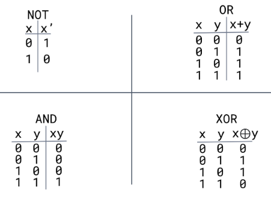
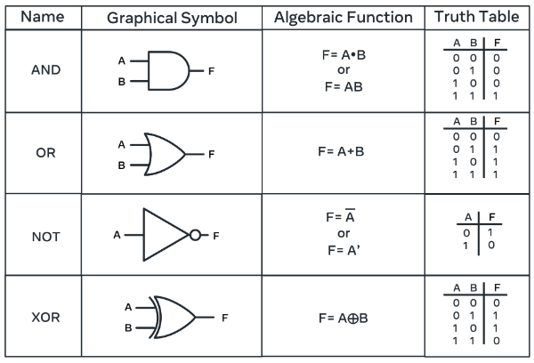
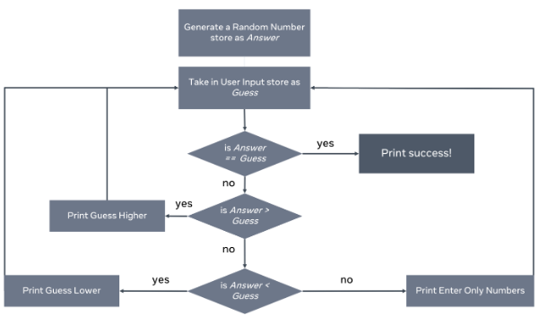
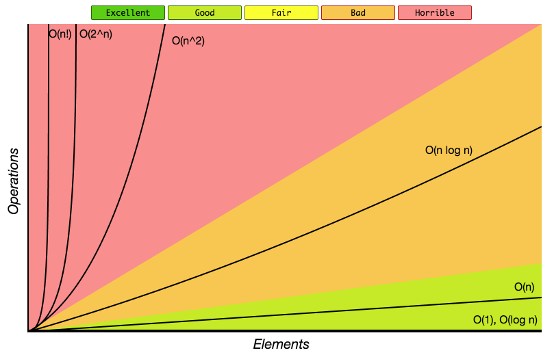
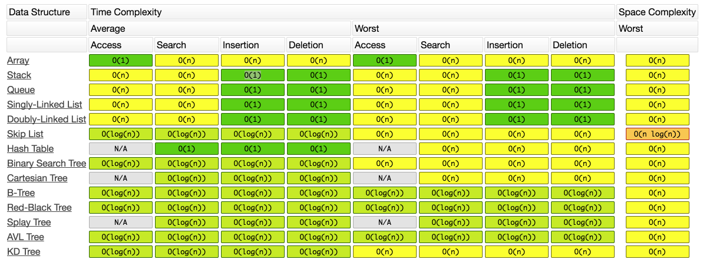

# CS Note

## Table of Contents
1. [Computer Memory and CPU Overview](#memory)
2. [Binary](#binary)
3. [Flow Chart](#flow_chart)
4. [Time & Space Complexity](#time&space_complexity)
5. [Data Structure](#data_structure)
6. [Sorting & Searching](#sort_search)
7. [Algorithms](#algorithm)
   
---

## Computer Memory and CPU Overview

<b>(click to expand/hide)</b>

<!-- MarkdownTOC -->
  
### Introduction
- **Byte**: Consists of eight bits. 
- **Bit**: Simplest form of computing memory.
- **Memory Capacity**: Number of bytes a computer can hold.

### Central Processing Unit (CPU)
- Core of a computer.
- Processes both information and instructions.
- Works faster than the transfer of information.
- Switches tasks to allow info transfer to cache.

### Memory Types

#### Cache Memory
- Closest and fastest memory to the CPU.
- Most expensive type of memory.
- **Function**: When CPU gets an instruction, it checks cache first.
  - If info is in cache: it gets processed.
  - If not: CPU accesses main memory.
- Organized in zones: Zone 1 (most important) and subsequent zones (lesser importance).

#### Main Memory
1. **RAM (Read Access Memory)**:
   - Volatile: Info is lost when power is cut.
   - Holds data and instructions currently in use.
   - More RAM = Faster system due to improved transfer rate.
   
2. **ROM (Read Only Memory)**:
   - Non-volatile: Info retained when power is off.
   - Pre-programmed and cannot be altered.
   - Contains critical instructions/data, especially during startup.

#### Secondary Memory
- External memory solutions.
- Slower access compared to main and cache memory.
- Must transfer info to RAM for access.
- **Examples**: Cloud storage, external hard drives, memory sticks.

#### Resources
- Memory can be stored side-by-side or spread out throughout your computer. For some insights on this, you might be interested in reading more about [heap versus stack memory](https://courses.engr.illinois.edu/cs225/fa2022/resources/stack-heap/)

<!-- /MarkdownTOC -->

---

## Binary

<b>(click to expand/hide)</b>

<!-- MarkdownTOC -->

### Boolean logic
#### Truth Table

#### Gates

<!-- /MarkdownTOC -->

---

## Flow Chart

<b>(click to expand/hide)</b>

<!-- MarkdownTOC -->

#### flow chart example

<!-- /MarkdownTOC -->

---

## Time and Space Complexity

<b>(click to expand/hide)</b>

<!-- MarkdownTOC -->

### Time Complexity

### Space Complexity
space complexity = input space + auxiliary space

### Big-O notation (Time & space complexity)

#### Time & Space Complexity Table

#### Resources
- A discussion of [time and space costs](https://www.cs.utexas.edu/users/djimenez/utsa/cs1723/lecture2.html) and plus some helpful examples
- A Scaler Topics article about [space complexity](https://www.scaler.com/topics/data-structures/space-complexity-in-data-structure/)

<!-- /MarkdownTOC -->

---

## Data Structure

<b>(click to expand/hide)</b>

<!-- MarkdownTOC -->

### Basic Data Structure
#### Resources
- This [Array basics](https://www.cs.fsu.edu/~myers/c++/notes/arrays.html) article provides an excellent write-up on arrays and how they are initialized and used. 
- This article called [Immutable data structures in F#](https://www.compositional-it.com/news-blog/immutable-data-structures-in-f/) provides an analysis of mutable versus immutable data structures:
- This article about [First-class objects](https://isaaccomputerscience.org/concepts/prog_func_first_class_objects?examBoard=all&stage=all) outlines what a first-class object is

### Collection Data Structures
#### Resources
- This article about [Understanding Java tree APIs](https://www.developer.com/design/understanding-java-tree-apis/) provides some excellent additional insight into different types of trees and the various attributes associated with them.
- This article about [Binary trees in C](https://data-flair.training/blogs/binary-tree-in-c/) gives a breakdown of how trees are used in C. The focus is on the binary tree and the various types of binary trees and how one would implement them.
- This article about [C# collections](https://www.tutorialspoint.com/csharp/csharp_collections.htm) gives an overview things like arraylist, hashtable, lists and so on implemented in C#.
- This article about [Trees](https://isaaccomputerscience.org/concepts/dsa_datastruct_tree?examBoard=all&stage=all) provides an informative analysis of trees.
- This article about [Array-based lists](https://opendatastructures.org/ods-cpp/2_Array_Based_Lists.html) gives more information relating to lists that are backed by arrays.
- This article called [What are static and dynamic data structures](https://www.scaler.com/topics/static-and-dynamic-data-structure/) gives an interesting breakdown and analysis of static and dynamic data structures

### Advanced Data Structures
#### Resources
- When discussing hashing the probability of collisions was introduced. Learn more about the statistics behind the 
[birthday paradox](https://www.scientificamerican.com/article/bring-science-home-probability-birthday-paradox/).
- An excellent breakdown of [graphs](https://www.shiksha.com/online-courses/articles/graphs-in-data-structure-types-representation-operations/) with associated terminology;
- Information on [heaps](https://www.cs.auckland.ac.nz/software/AlgAnim/heaps.html) how to add and remove from them/

<!-- /MarkdownTOC -->

---

## Sorting and Searching

<b>(click to expand/hide)</b>

<!-- MarkdownTOC -->

### Sorting

#### Selection Sort
- Worst case: O(N^2)
- Average case: O(N^2)
- Best case: O(N^2)
- Space complexity: O(1) Auxiliary

#### Quick Sort
- Worst case: O(N^2)
- Average case: O(N log N)
- Best case: O(N log N)
- Space complexity: O(N) Auxiliary

### Searching

#### Linear Search
- Worst case: O(N)
- Average case: O(N)
- Best case: O(1)
- Space complexity: O(N) Auxiliary

#### Binary Search
- Worst case: O(log N)
- Average case: O(log N)
- Best case: O(1)
- Space complexity: O(N) Auxiliary

#### Resources
- Here is an article on [Time and space complexity of selection sort](https://iq.opengenus.org/time-complexity-of-selection-sort/). It includes an implementation of selection sort and how one can calculate the complexity involved.
- Here is an article about [Quick-sort](https://www.commonlounge.com/quick-sort-video-tutorial-pseudo-code-and-in-place-sorting-608c5c7284b148eb9d550e6166303142/) with a video tutorial and pseudocode. It provides a detailed analysis of various sorting algorithms, comparisons and further links to video explanations.

<!-- /MarkdownTOC -->

---

## Algorithms

<b>(click to expand/hide)</b>

<!-- MarkdownTOC -->

### Divide and Conquer
#### Merge Sort

### Recursion

### Dynamic programming
#### Memoization

### Greedy algorithms

#### Resources
- This article provides a comprehensive breakdown of various [algorithms](https://networkx.org/documentation/stable/reference/algorithms/index.html) that are graph specific. In this article, you will gain both an understanding of the data structure as well as insights into its implementation.
- This article discusses [space complexity](https://algodaily.com/lessons/understanding-space-complexity). In it, you will find a comparison between implementing iterative solutions versus recursive ones.
- This article explains what [recursion](https://web.mit.edu/6.031/www/fa20/classes/16-recursive-data-types/) is and which datatypes are most congenial for its implementation.

<!-- /MarkdownTOC -->

---
