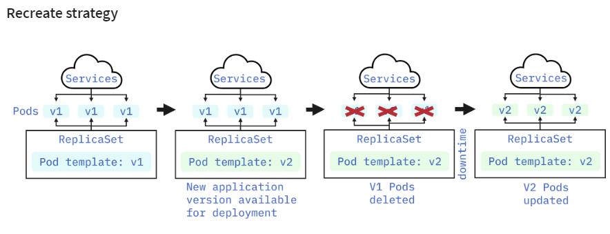
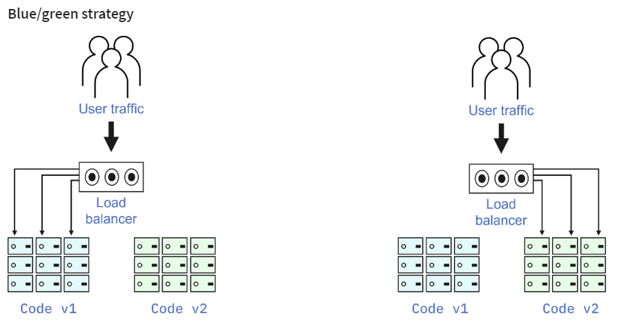
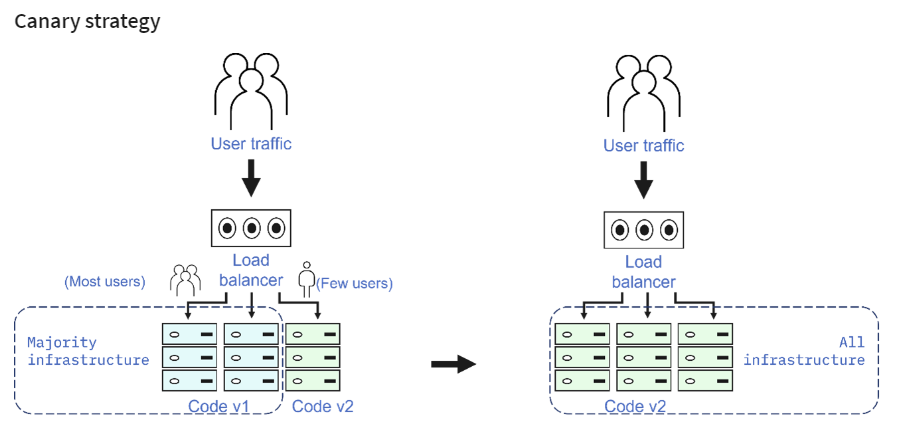
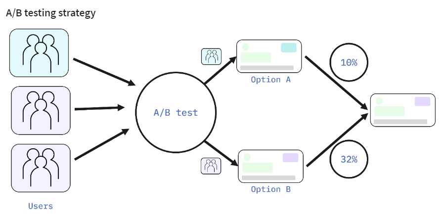
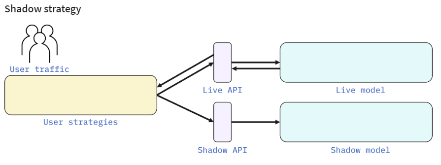

# Managing Application with Kubernetes

# Table of Contents
1. [ReplicaSet in Kubernetes](#replica_set)
2. [Autoscaling in Kubernetes](#autoscaling)
3. [Deployment Strategies](#deployment_strategies)
4. [Rolling Updates in Kubernetes](#rolling_updates)
5. [ConfigMaps and Secrets in Kubernetes](#configMaps_and_secrets)
6. [Service Binding in Kubernetes](#servic_binding)

# ReplicaSet in Kubernetes

<b>(click to expand/hide)</b>

<!-- MarkdownTOC -->

## Overview
- A ReplicaSet ensures that a specified number of pod replicas are running at any given time.
- It is crucial for ensuring high availability, handling outages, and accommodating application demand.

## Limitations of Single-Pod Deployments
Single pods can't:
- Handle increased load through load balancing.
- Provide redundancy (single point of failure).
- Ensure high availability or automatic restarts during outages.

## Benefits of ReplicaSet
- **Scalability & Redundancy**: Adjusts the number of running pods to meet the desired state.
- **Failure Handling**: Automatically replaces failed pods.
- **Controlled by Deployment**: It's recommended to manage ReplicaSets through deployments for additional features.

## How ReplicaSet Works
- Doesn't own pods but uses labels to identify which pods to manage.
- Ensures the actual running pods match the desired state.
- Created automatically through deployments.

## Working with ReplicaSet
- A ReplicaSet is generated by default when a deployment is created.
- You can create a ReplicaSet directly using a YAML file with `kind: ReplicaSet`.
- Recommended to use within a deployment for added benefits and easier management.

## Commands for Managing ReplicaSet
- Create a deployment: `kubectl create -f deployment.yaml`
- Check created ReplicaSet: `kubectl get ReplicaSet`
- Create a ReplicaSet directly: `kubectl create -f replicaset.yaml`
- Scale a deployment: `kubectl scale deployment <DEPLOYMENT_NAME> --replicas=3`
- Check running pods: `kubectl get pods`
- Delete a pod: `kubectl delete pod <POD_NAME>`

## Scaling and Desired State
- ReplicaSets allow for scaling operations by adjusting the number of replicas.
- They continuously monitor and maintain the state of pods to ensure it matches the desired configuration.
- If a pod is manually deleted or added, the ReplicaSet takes action to correct the total count back to the desired state.

## Best Practices
- While ReplicaSets can be created directly, it's a best practice to use deployments.
- Deployments offer additional features, including rolling updates.

## Conclusion
- ReplicaSets are essential for high availability, scaling, and resilience in Kubernetes applications.
- They work best under the management of deployments for streamlined updates and features.

## Additional Resources
- More on Kubernetes ReplicaSets can be found in the [official documentation](https://kubernetes.io/docs/concepts/workloads/controllers/replicaset/).

<!-- /MarkdownTOC -->

---

# Autoscaling in Kubernetes

<b>(click to expand/hide)</b>

<!-- MarkdownTOC -->

## Overview
Autoscaling optimizes resource usage and costs by automatically adjusting the number of running instances or resources in response to current demand.

### Objectives
- Understand what autoscaling is.
- Identify the types of autoscalers in Kubernetes.
- Learn how each autoscaler operates.

## Types of Autoscalers

### 1. Horizontal Pod Autoscaler (HPA)
- Adjusts the number of pod instances in a deployment or ReplicaSet.
- Operates based on CPU utilization or other select metrics.
- Responds to the workload changes by scaling the number of pods up or down.

#### How HPA Works
- Metrics like CPU utilization trigger scaling actions.
- As demand increases, HPA increases the number of pods ("scaling out").
- When demand drops, HPA decreases the number of pods ("scaling in").

### 2. Vertical Pod Autoscaler (VPA)
- Adjusts the compute resources of containers in pods.
- Increases or decreases the CPU and memory reservations as needed.
- Not typically used alongside HPA for the same resource metrics.

#### How VPA Works
- VPA adjusts the resources of the pods (CPU, memory) based on demand.
- During high demand, VPA increases resources ("scaling up").
- As demand decreases, it reduces the resources ("scaling down").

### 3. Cluster Autoscaler (CA)
- Adjusts the size of the Kubernetes cluster.
- Adds or removes nodes from the cluster based on the overall demand.

#### How CA Works
- When pod requests increase, CA adds new nodes to the cluster.
- CA removes nodes during low demand to optimize resource usage and costs.

## Key Takeaways
- Autoscalers ensure efficient use of resources in a Kubernetes cluster.
- HPA, VPA, and CA serve different purposes and can sometimes be used in combination for effective scaling.
- It's essential to choose the right type of autoscaler based on workload requirements and cost considerations.

## Best Practices
- Use `autoscale` command for HPA instead of manual configuration for ease of use.
- Don't use VPA and HPA together on the same CPU/memory metrics.
- Analyze specific needs to choose the appropriate autoscaler or combination of autoscalers.

<!-- /MarkdownTOC -->

---

# Deployment Strategies

<b>(click to expand/hide)</b>

<!-- MarkdownTOC -->

## Overview

A Kubernetes deployment strategy defines an application’s lifecycle, ensuring the desired state for objects and applications is achieved and maintained automatically. These strategies minimize risk during deployment.

Kubernetes deployment strategies enable you to:
- Deploy, update, or rollback ReplicaSets, Pods, Services, and Applications
- Pause/Resume Deployments
- Scale Deployments either manually or automatically

## Types of Deployment Strategies

There are several deployment strategies, including:
- Recreate
- Rolling
- Blue/Green
- Canary
- A/B testing
- Shadow

Each strategy has its unique approach and use cases. They can be used independently or combined, depending on the deployment requirements.

### Recreate Strategy

The recreate strategy involves stopping all existing Pods and starting new ones.

#### Steps
1. Prepare the new application version (v2).
2. Shut down all current version (v1) Pods.
3. Deploy the new version (v2) Pods.

#### Pros and Cons
- **Pros**: Simple setup
- **Cons**: Downtime during redeployment

### Rolling Strategy
strategy.png)
The rolling update strategy incrementally replaces Pods with new ones.

#### Steps
1. Release the new application version.
2. Replace each existing Pod with a new version, one after another.
3. The process continues until all Pods are updated.

#### Pros and Cons
- **Pros**: Zero downtime, suitable for stateful applications
- **Cons**: Slower deployment, no traffic control

### Blue/Green Strategy

This strategy involves having two identical production environments (blue and green).

#### Steps
1. The 'green' environment is set up with the new version.
2. Once ready, the traffic is switched from 'blue' to 'green'.
3. For rollback, traffic is redirected to 'blue'.

#### Pros and Cons
- **Pros**: Instant rollback, no downtime
- **Cons**: High resource cost, demands extensive testing

### Canary Strategy

The canary release strategy exposes a subset of users to the new application version.

#### Steps
1. Deploy the new version.
2. Route a small percentage of traffic to the new version.
3. Gradually increase traffic as confidence grows.

#### Pros and Cons
- **Pros**: Reduced risk due to phased rollout
- **Cons**: More complex setup, slower complete rollout

### A/B Testing Strategy

A/B testing involves providing two versions to different user sets.

#### Steps
1. Release both versions of the application.
2. Direct user segments to each version based on specific criteria.
3. Analyze performance and user feedback.

#### Pros and Cons
- **Pros**: Direct feedback, control over traffic distribution
- **Cons**: Complexity, requires advanced traffic routing

### Shadow Strategy

The shadow strategy deploys a 'shadow' version alongside the live version.

#### Steps
1. Duplicate live traffic to the shadow version.
2. The shadow version processes requests but doesn't impact the live system.

#### Pros and Cons
- **Pros**: Real-world testing without user impact
- **Cons**: High resource cost, doesn't capture user interaction

## Deployment Strategies Summary

| Strategy  | Zero Downtime | Real Traffic Testing | Targeted Users | Cloud Cost | Rollback Duration | User Impact | Setup Complexity |
|-----------|:-------------:|:--------------------:|:--------------:|:----------:|:-----------------:|:-----------:|:----------------:|
| Recreate  |       X       |          X           |       X        |     •--    |        •••        |     •••     |        ---       |
| Ramped    |      ✓        |          X           |       X        |     •--    |        •••        |     •--     |        •--       |
| Blue/Green|      ✓        |          X           |       X        |     •••    |        ---        |     ••-     |        ••-       |
| Canary    |      ✓        |         ✓            |       X        |     •--    |        •--        |     •--     |        ••-       |
| A/B Testing|     ✓        |         ✓            |      ✓         |     •--    |        •--        |     •--     |        •••       |
| Shadow    |      ✓        |         ✓            |       X        |     •••    |        ---        |     ---     |        •••       |

## Conclusion

Selecting the right strategy depends on several factors including the application type, target audience, and desired balance between speed and safety. Consider the specifics of your project, resources, and the potential impact on users before deciding on the most suitable deployment strategy.

<!-- /MarkdownTOC -->

---

# Rolling Updates in Kubernetes

<b>(click to expand/hide)</b>

<!-- MarkdownTOC -->

## Overview
This document summarizes the concept of rolling updates in Kubernetes, demonstrating how they provide automated, controlled application updates across pods with zero downtime, and how rollbacks can be efficiently handled.

## Objectives
- Understand what rolling updates are and their workflow.
- Prepare an application for rolling updates.
- Execute and rollback a rolling update.

## What are Rolling Updates?
- Automated updates that incrementally replace application instances with new ones.
- Work with pod templates, particularly deployments.
- No downtime for the application as it updates.
- Allows for easy rollback if the update is problematic.

## Preparing for Rolling Updates
1. **Add Probes**: Implement liveness and readiness probes for deployments, ensuring instances are marked as 'ready'.
2. **Update Strategy**: Incorporate a rolling update strategy in the deployment's YAML file.
   - **maxUnavailable**: Number (or percentage) of pods that can be unavailable during the update.
   - **maxSurge**: Number (or percentage) of pods that can be created above the desired amount.
   - **minReadySeconds**: Minimum number of seconds a pod should be ready for it to be considered available.
   - For zero downtime, set `maxUnavailable` to 0.

## Performing a Rolling Update
- Update the application's image and push the new version to a container registry (e.g., Docker Hub).
- Apply the new image to your deployment in Kubernetes.
- Monitor the status with the `rollout status` command.
- Verify the update by checking the application's output or response.

## Rolling Back an Update
- Use the `rollout undo` command to revert to a previous deployment state if an update is faulty or not required.
- Confirm the changes by inspecting the status of pods or the application's output.

## Strategies for Updates and Rollbacks
- **All-at-once**: Version N-1 is deactivated then version N is activated. This strategy can block user access momentarily.
- **One-at-a-time (Staggered)**: Pods are updated incrementally, maintaining continuous user access.

## Conclusion
- Rolling updates are essential for maintaining applications without interrupting their availability.
- Preparation with the correct parameters is crucial for successful rolling updates.
- Kubernetes allows for efficient rollbacks in case of update failures.
- Both all-at-once and one-at-a-time strategies have their use cases and can be chosen based on the application's tolerance for brief downtimes.

<!-- /MarkdownTOC -->

---

# ConfigMaps and Secrets in Kubernetes

<b>(click to expand/hide)</b>

<!-- MarkdownTOC -->

## Introduction

This guide provides an overview of ConfigMaps and Secrets within Kubernetes. Both are Kubernetes objects that provide a way to inject configuration data into pods. This allows for the separation of configuration from the application's image, facilitating updates and maintaining sensitive information securely.

## ConfigMaps

### Key Characteristics

- **Purpose**: Store non-confidential data in key-value pairs.
- **Usage**: Decouple configuration details from application code.
- **Size Limit**: Cannot exceed 1MB.
- **Data Fields**: Support for optional data and binary data fields.
- **Naming Restrictions**: Must conform to DNS subdomain names.
- **Reusability**: Can be used across multiple deployments.

### Creation Methods

1. **Using String Literals**: Directly from the command line.
2. **From Properties File**: Using key-value pairs from an existing file.
3. **From YAML File**: Applying a YAML descriptor file.

### Utilization in Pods

- Injected as environment variables via `configMapKeyRef`.
- Mounted as files within pods using volume plugins.

### Practical Usage

- Define ConfigMaps before deploying pods or applications.
- Reference ConfigMaps in deployment descriptors.
- Variables within ConfigMaps are accessible within the application (e.g., `process.env.VARIABLE_NAME`).

## Secrets

### Overview

- Similar to ConfigMaps but used for storing sensitive information.
- Content is base64 encoded.

### Creation Methods

1. **Using String Literals**: Create directly from the command line.
2. **From Environment Variables**: Storing each sensitive piece of information as an environment variable.
3. **From Files**: Using a volume that references the Secret.

### Handling Secrets

- Verified through the 'get' and 'describe' commands, but the actual secrets are not plainly visible.
- Can be mounted as volumes or exposed as environment variables.

### Practical Usage

- Secrets are referenced within the application code securely (e.g., `process.env.SECRET_KEY`).
- When mounted as files, applications read from the filesystem to retrieve the secret values.

## Conclusion

ConfigMaps and Secrets are essential Kubernetes features that enhance security and manageability. By externalizing application configuration and sensitive information, they promote best practices in software development and deployment, allowing for more flexible, secure, and modular applications.

<!-- /MarkdownTOC -->

---

# Service Binding in Kubernetes

<b>(click to expand/hide)</b>

<!-- MarkdownTOC -->

## Overview

This summary covers the concept of service binding within a Kubernetes environment, emphasizing its role, implementation steps, and usage in applications, particularly using the IBM Cloud Service example.

## Understanding Service Binding

- **Definition**: Service binding connects applications to external services (e.g., databases, APIs, event buses) by managing configurations and safeguarding credentials.
- **Functionality**: It exposes service credentials securely within a Kubernetes cluster, typically through Kubernetes Secrets.

## Key Benefits

- Simplifies application connections to services.
- Automates credential management, enhancing security.
- Avoids hardcoding sensitive information in application code.

## Process of Service Binding

### Step 1: Provisioning the Service

- Create an instance of the desired service, like IBM's Tone Analyzer, either via command line or through the service's UI.

### Step 2: Binding the Service

- Bind the service instance to the Kubernetes cluster, generating credentials that will be used for secure interaction between the application and the service.

### Step 3: Storing Credentials

- Service credentials are stored in a Kubernetes Secret, encoded in base64, ensuring security within the cluster's environment.

### Step 4: Configuring the Application

- Set up the application to access the stored credentials, enabling it to interact securely with the bound service.

## Implementation in Kubernetes

- Service binding credentials become available to applications automatically after binding.
- Credentials can be consumed using `volumeMounts` and `volumes` or injected as environment variables into the application's pods.

## Accessing Secrets within the Cluster

- Use commands like `kubectl get secrets` to list all secrets or access through the Kubernetes Dashboard.
- Secrets can be mounted as volumes or referenced in environment variables within the application's pods.

## Practical Example

- A Node.js application can access service credentials by referencing environment variables such as `binding.APIkey`, `binding.username`, and `binding.password`.
- These credentials are used within the application's code to authenticate and interact with the external service securely.

## Conclusion

Service binding is a critical practice in secure, efficient, and scalable software deployment within Kubernetes environments. It abstracts sensitive credential handling away from application code, promoting security best practices, and simplifying configuration management.

<!-- /MarkdownTOC -->

---

# 

<b>(click to expand/hide)</b>

<!-- MarkdownTOC -->

<!-- /MarkdownTOC -->

---
